# Secure Networking Tracker

A small full-stack web app for keeping track of the people you meet at Berkeley and want to stay connected with. Each user signs up with email and password, then adds contacts with a name, company, role, where you met, notes and a priority. Contacts can be searched, filtered by priority and sorted by name, priority or date added. Every row in the database is owned by the user who created it and Postgres Row Level Security guarantees that no user can read or change anyone else's contacts, even though the database API endpoint is publicly reachable.

## Live demo

- Vercel: https://networking-tracker-lovat-gamma.vercel.app

## Screenshots

Screenshots 01 to 09, 11 and 12 were taken on the live Vercel deployment; 10 is the local test run. Files live in `docs/screenshots/`. Each one is embedded in the section it proves; this table is the index.

| # | File | What it proves | Shown in |
| --- | --- | --- | --- |
| 01 | `01-sign-in.png` | Sign-in page on the production URL | [Auth and RLS](#how-auth-and-rls-keep-contacts-private) |
| 02 | `02-contact-list.png` | Sortable table with priority filter and search | [Features](#features) |
| 03 | `03-add-contact.png` | Add contact dialog | [Features](#features) |
| 04 | `04-edit-contact.png` | Edit contact dialog pre-filled with the saved row | [Features](#features) |
| 05 | `05-after-refresh.png` | Data persists in Neon after a full page reload | [Database schema](#database-schema-contacts) |
| 06 | `06-delete.png` | Delete with success toast | [Features](#features) |
| 07 | `07-invalid-input.png` | Server-side validation error shown inline, no crash | [Validation](#validation) |
| 08 | `08-user-b-empty.png` | A second account sees none of the first account's rows | [Auth and RLS](#how-auth-and-rls-keep-contacts-private) |
| 09 | `09-sign-out.png` | Sign out returns to the sign-in page | [Auth and RLS](#how-auth-and-rls-keep-contacts-private) |
| 10 | `10-npm-test.png` | `npm test` passing, 8 of 8 | [Tests](#tests) |
| 11 | `11-filter-search.png` | Priority filter and text search applied together | [Features](#features) |
| 12 | `12-mobile.png` | Mobile viewport with the card layout | [Features](#features) |

## Features

- Sign up, sign in and sign out with email and password (Neon Auth, Managed Better Auth)
- Add, view, edit and delete contacts: name, company, role, where met, notes, priority
- Sortable table by name, priority and created date, ascending or descending
- Filter by priority and free-text search across name, company, role, where met and notes
- Explicit UI states: loading skeletons, empty state, success toasts, inline error messages with retry
- Responsive layout: card list on mobile, table on desktop
- Shared zod validation enforced on the server, with database CHECK constraints as a backstop
- Per-user data isolation enforced by Postgres Row Level Security

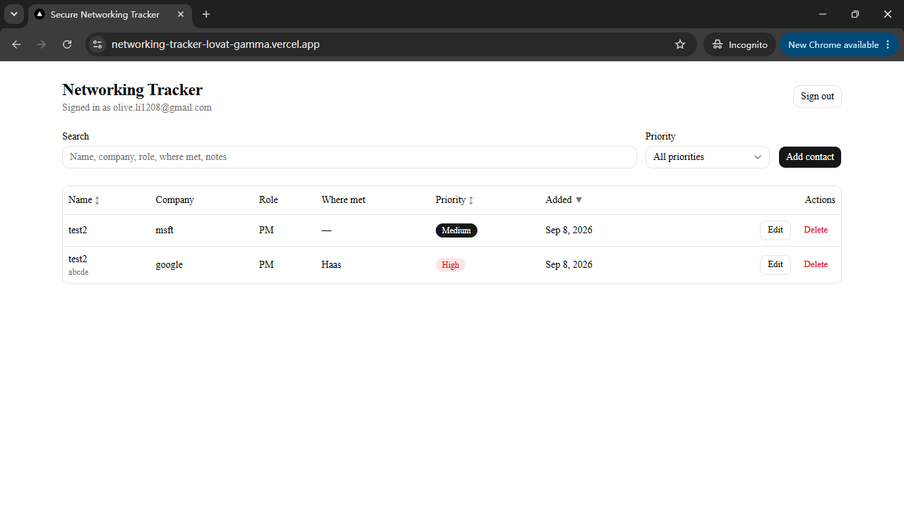

*Signed-in contact list on production. Name, Priority and Added headers are sortable, the priority dropdown filters, and the search box matches across all text fields.*

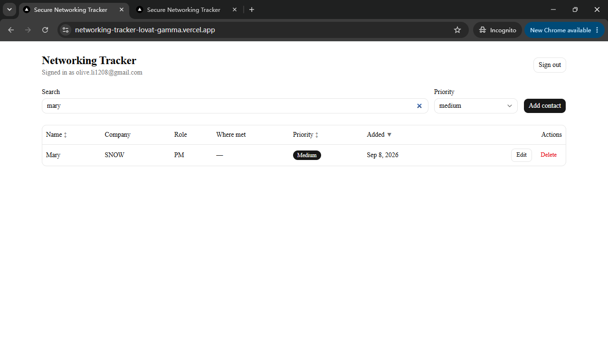

*Priority filter set to medium and "mary" typed in the search box. The list narrows to the single matching contact; both controls apply together.*

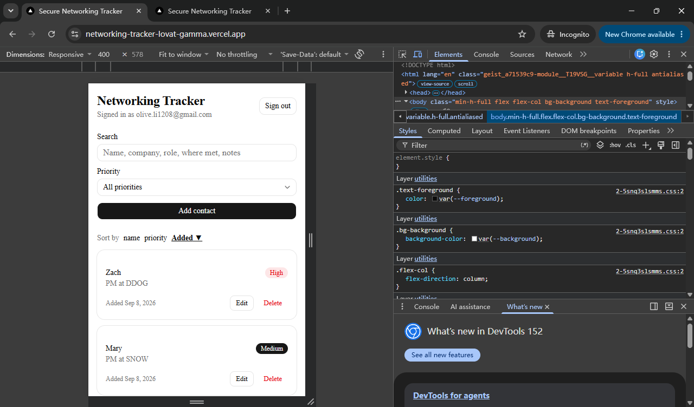

*The same page at a 400px mobile viewport. The table becomes stacked cards with the sort controls moved into a text row above them.*

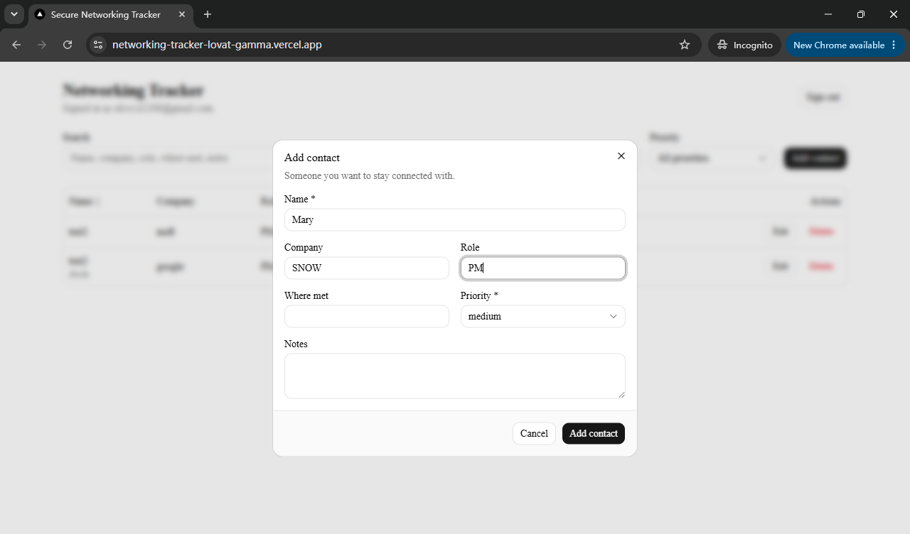

*Add contact dialog. Every field in the spec is present; only name and priority are required.*

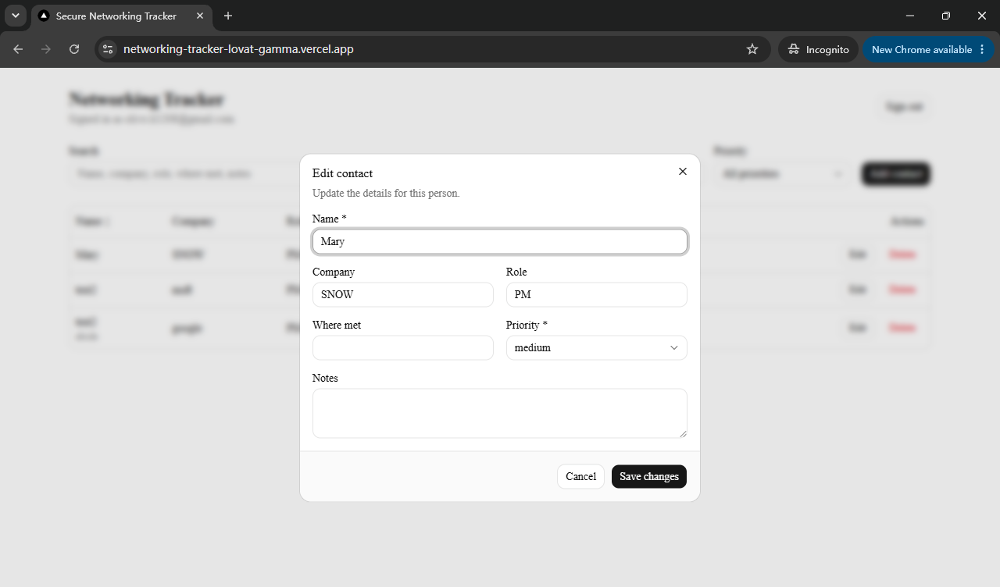

*Edit dialog opened on the contact just created. The form is pre-filled from the row returned by the database, proving the insert round-trip.*

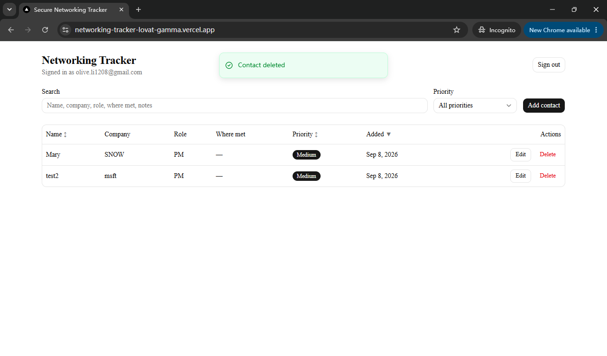

*After confirming a delete, the row is gone and a success toast confirms it.*

## Tech stack and why

| Layer | Choice | Why |
| --- | --- | --- |
| Framework | Next.js 16 (App Router) + TypeScript | One codebase for UI and server code; server actions give a typed server boundary without writing a REST layer. |
| UI | Tailwind CSS v4 + shadcn/ui | Accessible, unstyled-by-default primitives that are copied into the repo, so there is nothing to eject from. |
| Database | Neon Postgres | Serverless Postgres with branching; RLS and CHECK constraints live in the database, not the app. |
| Auth | Neon Auth (Managed Better Auth) | Hosted email/password auth that issues JWTs the Data API understands, so no auth server to run. |
| Data access | Neon Data API via `@neondatabase/neon-js` | PostgREST-style client; the user's JWT is attached to every request so RLS applies automatically. |
| Validation | zod | One schema shared by the form types and the server actions. |
| Tests | Vitest | Fast, zero-config TypeScript tests for the validation schema. |
| Hosting | Vercel | First-class Next.js hosting; environment variables are set in the dashboard. |

## Architecture

**Frontend** (`app/`, `components/`): React client components render the sign-in form, toolbar, table and dialogs. They hold only view state (search text, sort key, which dialog is open). They contain no validation and no database calls.

**Shared logic** (`lib/`): `lib/contacts/schema.ts` is the zod schema and `Contact` type. `lib/contacts/query.ts` holds the pure sort, filter and search functions. `lib/neon/client.ts` creates the browser Neon client using the two-URL object form of `createClient()` and exposes the current JWT. `lib/auth.ts` wraps sign up, sign in and sign out.

**Backend** (`server/`): `server/contacts.ts` contains Next.js server actions for list, create, update and delete. Each one validates input with the shared zod schema and then calls the Neon Data API. `server/neon.ts` builds a Data API client that carries the caller's JWT so the database sees the request as that user.

**Database**: one `contacts` table in Neon Postgres with CHECK constraints and four RLS policies. `db/migrations/0001_contacts.sql` is the complete migration.

**Auth**: Neon Auth hosts the Better Auth server. The browser SDK stores the session in an HttpOnly cookie on the Neon Auth domain and receives a short-lived JWT whose `sub` claim is the user id and whose `role` claim is `authenticated`.

**Hosting**: Vercel serves the Next.js app. Neon serves the database, the auth service and the Data API.

### Request flow (adding a contact)

1. The user submits the Add contact dialog. The component collects the field values and calls the `createContact` server action, passing the user's JWT read from the Neon Auth session.
2. On the server, `createContact` runs the zod schema. If it fails, the action returns `{ error: "Name is required" }` and the dialog shows that message. Nothing reaches the database.
3. If it passes, the server creates a Data API client with that JWT and issues an insert. `user_id` is not sent. The column defaults to `auth.user_id()`, which the Data API derives from the JWT.
4. Postgres evaluates the insert policy's `WITH CHECK (auth.user_id() = user_id)` and the CHECK constraints. If anything fails, the Data API returns an error and the action maps it to a readable sentence.
5. The inserted row is returned to the browser, which adds it to the table and shows a success toast.

## Local setup

Prerequisites: Node.js 20 or newer, npm, a Neon project with Neon Auth and the Data API enabled.

```powershell
git clone <your-repo-url> networking-tracker
cd networking-tracker
npm install
Copy-Item .env.example .env.local
# Edit .env.local and fill in the values from the Neon console (see Environment variables)
npm run dev
```

Then open the Neon SQL Editor, paste the whole of `db/migrations/0001_contacts.sql` and run it once. Visit `http://localhost:3000`, create an account and add a contact.

## Environment variables

| Name | Used by | Purpose |
| --- | --- | --- |
| `NEXT_PUBLIC_NEON_AUTH_URL` | Browser | Neon Auth endpoint for this database branch. Public by design. |
| `NEXT_PUBLIC_NEON_DATA_API_URL` | Browser and server | Neon Data API (PostgREST) endpoint. Public by design; RLS protects the data. |
| `DATABASE_URL` | You, locally | Direct Postgres connection string. Only needed if you run the migration with a CLI instead of the SQL Editor. Never commit it. |

`.env.example` lists the names with placeholder values. `.env.local` is ignored by git.

`NEON_AUTH_BASE_URL` and `NEON_AUTH_COOKIE_SECRET` are not used. They belong to the separate `@neondatabase/auth/next/server` cookie-proxy integration, which this project does not use. Auth runs through the `@neondatabase/neon-js` browser client, so there is no cookie secret to protect.

### Secrets audit

- The only committed env file is `.env.example`, which contains placeholder values only.
- The full git history was scanned for `postgresql://` connection strings, Neon `npg_` passwords, cookie secrets and populated `DATABASE_URL` lines. The only hit is the placeholder line in `.env.example`.
- No file under `app/`, `components/`, `lib/` or `server/` references `DATABASE_URL` or any secret. The two `NEXT_PUBLIC_` URLs are the only values that reach the browser, and both are public by design.

## Database schema: `contacts`

| Column | Type | Constraints | Notes |
| --- | --- | --- | --- |
| `id` | `uuid` | primary key, default `gen_random_uuid()` | |
| `user_id` | `text` | not null, default `auth.user_id()` | Owner. Filled from the JWT, never by the client. |
| `name` | `text` | not null, CHECK `btrim(name) <> ''` | Rejects empty and whitespace-only names. |
| `company` | `text` | nullable | |
| `role` | `text` | nullable | |
| `where_met` | `text` | nullable | |
| `notes` | `text` | nullable | |
| `priority` | `text` | not null, CHECK in `('high','medium','low')` | |
| `created_at` | `timestamptz` | default `now()` | Used for the "Added" sort. |

Row Level Security is enabled with four policies for the `authenticated` role: select, insert, update and delete. Each uses `auth.user_id() = user_id`. Insert and update also carry `WITH CHECK (auth.user_id() = user_id)`. The `authenticated` role is granted usage on the `public` schema and select, insert, update and delete on the table.

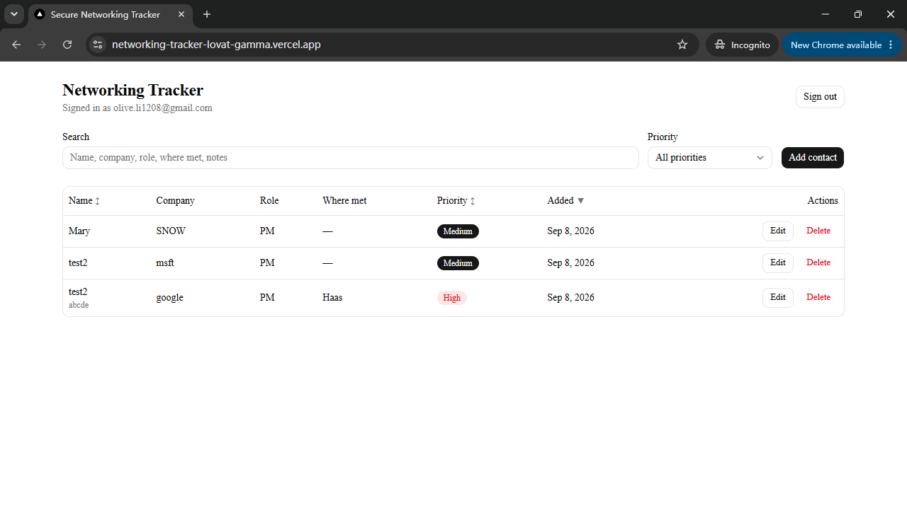

*The same list after a hard refresh. Rows come back from Neon Postgres, not browser state, so writes are persisted.*

## How auth and RLS keep contacts private

When you sign in, Neon Auth gives your browser a signed token that says who you are. Every request the app makes to the database carries that token. Inside Postgres, the function `auth.user_id()` reads your user id out of the token. The `contacts` table has Row Level Security switched on, which means Postgres hides every row by default and only shows or changes rows that a policy explicitly allows. All four policies say the same thing in different tenses: you may see, add, change or delete a row only if its `user_id` equals your id. The insert and update policies also check the row *after* the change, so you cannot create a contact under someone else's id or hand one of yours to another user. Because the check happens inside the database, it applies even if someone calls the public Data API URL directly with their own token and skips the app entirely. The app never has a privileged connection, so there is no path around it.

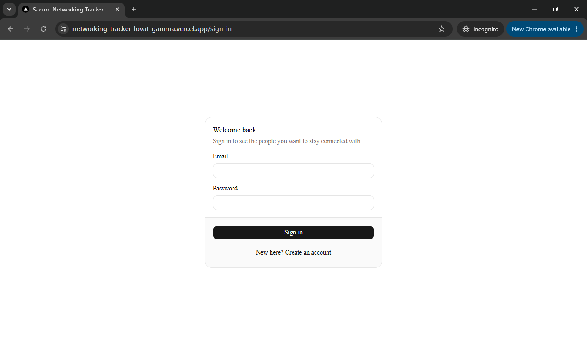

*Sign-in page on the live deployment. Unauthenticated visitors to `/` are redirected here.*

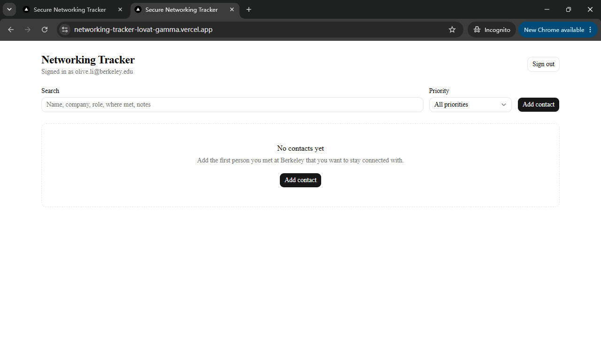

*A second account, signed in at the same time in another tab, sees "No contacts yet" while the first account has three rows. RLS hides the other user's data at the database level.*

The same rule blocks writes, not only reads. If User B sends an update or delete for one of User A's row ids, the update and delete policies filter that row out before the statement runs, so zero rows are affected. The server action then reports "That contact no longer exists." rather than leaking whether the row is real. Because `user_id` defaults to `auth.user_id()` and the insert and update policies carry `WITH CHECK`, a client cannot set `user_id` to another user's id either.

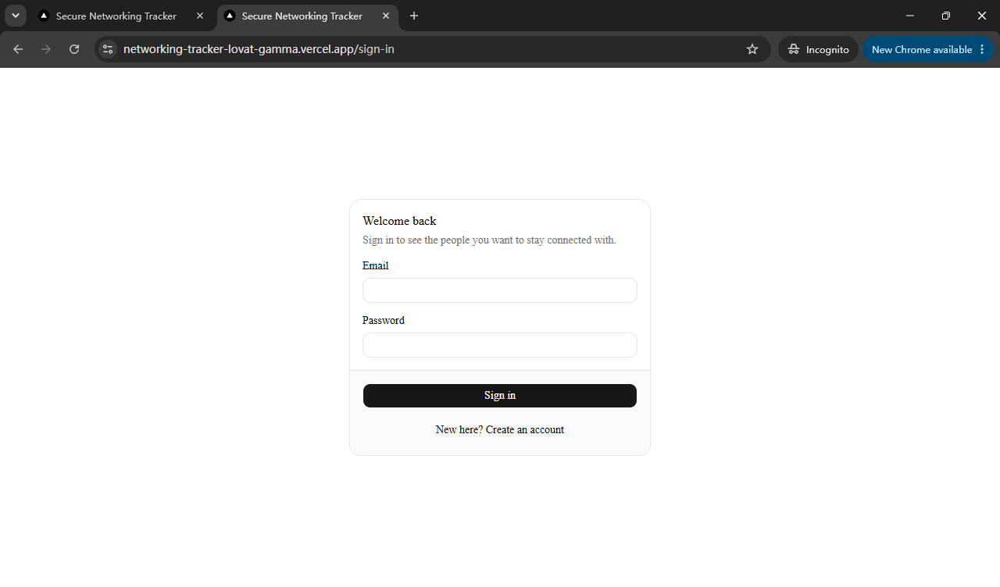

*After Sign out, the session is cleared and the app returns to the sign-in page.*

## Validation

The same zod schema, `lib/contacts/schema.ts`, is imported by the form (for field types) and by every server action (for enforcement). Server actions run `validateContactInput` before touching the database and return `{ error: "..." }` instead of throwing, so the dialog shows the message inline and the app never crashes. The database CHECK constraints on `name` and `priority` are the backstop for any request that bypasses the app.

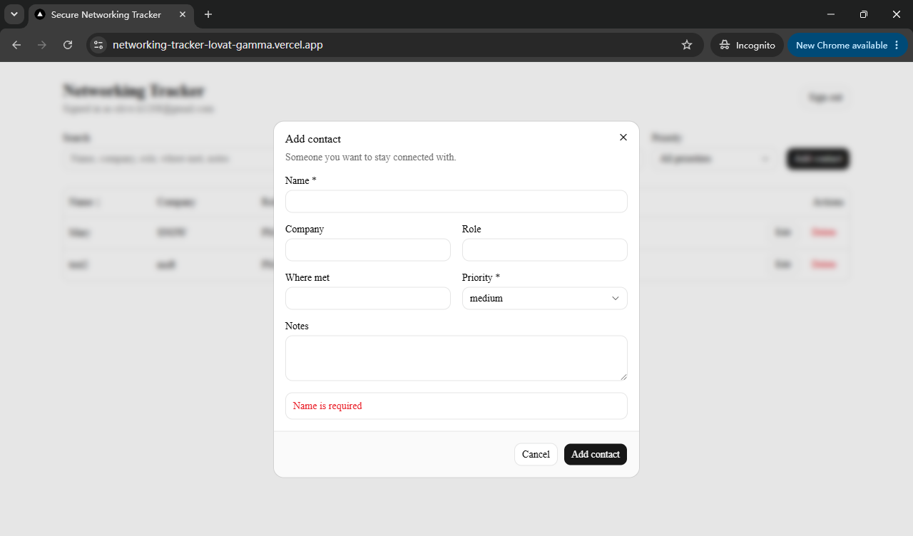

*Submitting the form with an empty name. The server action rejects it and the dialog shows the validation message inline.*

## Tests

```powershell
npm test
```

Runs Vitest on `tests/contact-schema.test.ts`, which proves that the shared zod schema:

- accepts a valid contact and trims whitespace
- accepts a contact with only the required fields and stores blanks as null
- rejects an empty name, a whitespace-only name and a missing name
- rejects an invalid priority such as `urgent` or an empty string
- returns a single readable message through `validateContactInput` instead of throwing

The most recent run is saved in `test-output.txt`.

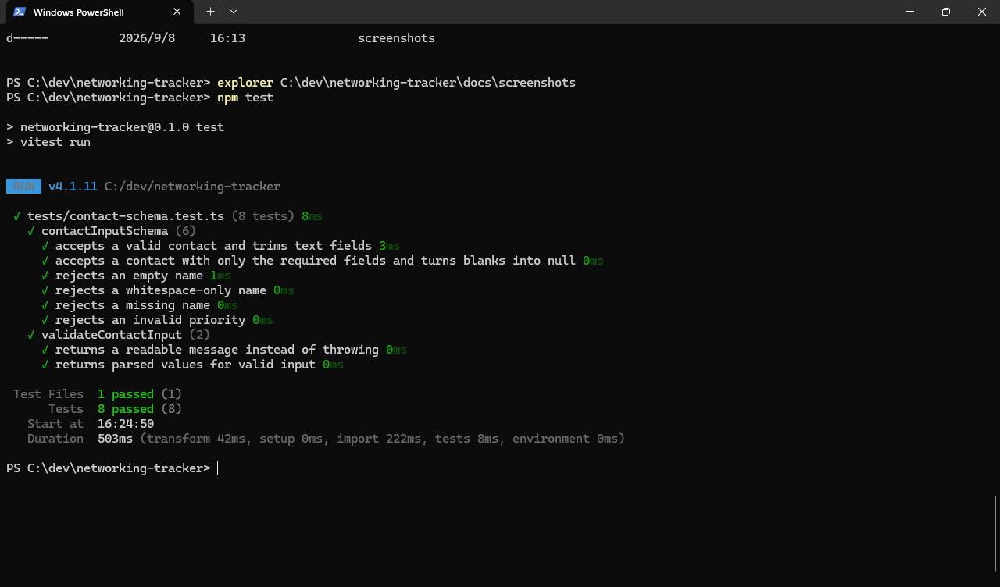

*`npm test` output: one file, eight tests, all passing.*

## Deployment (Vercel)

This project was deployed with the Vercel CLI. The dashboard import flow works the same way.

```powershell
npx vercel login
npx vercel link --yes --project networking-tracker
"https://<endpoint>.neonauth.<region>.aws.neon.tech/<db>/auth" | npx vercel env add NEXT_PUBLIC_NEON_AUTH_URL production --type config
"https://<endpoint>.apirest.<region>.aws.neon.tech/<db>/rest/v1" | npx vercel env add NEXT_PUBLIC_NEON_DATA_API_URL production --type config
npx vercel --prod
```

1. `--type config` marks the variables as public configuration. Both URLs are public by design; RLS protects the data behind them.
2. `DATABASE_URL` is not read by the deployed app and does not need to be set in Vercel.
3. After the first deploy, add the production origin (for example `https://networking-tracker-lovat-gamma.vercel.app`, no trailing slash) to Trusted domains in the Neon Auth settings. Without it, sign-in requests from the deployed site are rejected.
4. Use the stable production alias, not the team-scoped `*-<team>.vercel.app` alias, which is behind Vercel's deployment protection.

## Known limitations and next improvements

- Sorting, filtering and search run in the browser over the user's full list. This is fine for a personal contact list but should move to Data API query parameters if lists grow large.
- The server action trusts the JWT the browser sends only in the sense that it forwards it. The Data API verifies the signature, so a forged token gains nothing, but the server does not itself decode or check the token.
- No email verification or password reset flow. Neon Auth supports both and they could be enabled without schema changes.
- No pagination and no per-contact detail page.
- Only one test file, covering the validation schema. Component and end-to-end tests are the next step.
- `notes` is truncated to one line in the desktop table. A detail drawer would show it in full.
